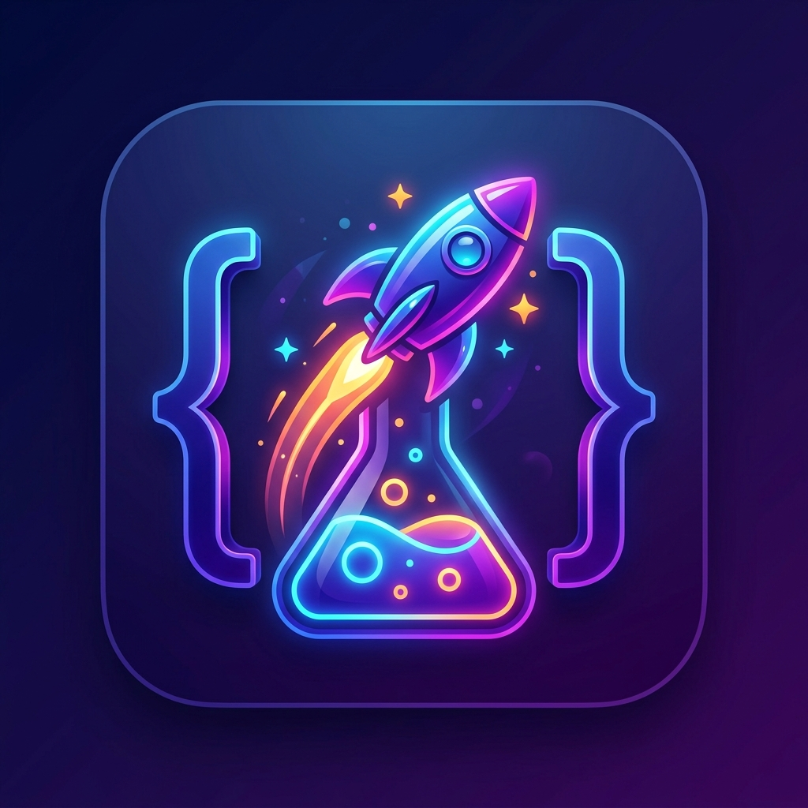

# 🚀 CodeLab

CodeLab adalah aplikasi pembelajaran interaktif *mobile-first* (berbasis Android/iOS) yang dirancang untuk membantu pengguna menguasai pemrograman dengan pendekatan gamifikasi yang imersif dan menyenangkan.

Dibangun dengan **Expo SDK 54** dan **React Native**, aplikasi ini dilengkapi dengan fitur pelacakan progres, sistem level (XP), *daily streak*, kuis, hingga inventaris lencana pencapaian.



## ✨ Fitur Utama

- 📚 **Kurikulum Terstruktur**: Modul komprehensif untuk **JavaScript**, **Laravel**, dan persiapan untuk pengembangan lintas platform (**Flutter**).
- 🎮 **Gamifikasi Kuat (Gamification Engine)**: 
  - Dapatkan XP untuk setiap pelajaran dan kuis yang diselesaikan.
  - Naik level dari *Newbie* hingga *CodeLab Hero*.
  - Pertahankan *Daily Streak* untuk menjaga motivasi.
  - Kumpulkan *Badges* eksklusif, kelola di dalam Inventaris, dan pamerkan lencana favorit (*Equip Badge*) di Profil Anda.
- 📳 **Pengalaman Sensorik (Haptics & Confetti)**: Dilengkapi dengan *Haptic Feedback* (*expo-haptics*) untuk respons sentuhan yang memuaskan dan animasi perayaan (*Confetti*) saat mencapai target.
- ⚡ **Performa & Arsitektur Kelas Enterprise**: 
  - Rendering memori efisien menggunakan `FlatList` untuk daftar panjang.
  - Arsitektur status *(State Management)* yang sangat modular (dipisah menjadi `useGamificationStore`, `useUserStore`, `useLessonStore`, dan `useSettingsStore`).
- 💾 **Offline-First & Data Persistence**: Progres belajar dan pengaturan pengguna disimpan secara lokal menggunakan `Zustand Persist` (mendukung Native `AsyncStorage` & Web `localStorage`).
- 🌓 **Tema & Personalisasi**: Mendukung *Dark/Light Mode* otomatis dan toggle bahasa (Indonesia / English).
- 🧭 **Navigasi Modern**: Menggunakan `Expo Router` untuk *file-based routing* yang rapi dengan *bottom tab navigation* (Home, Learn, Arena, Profile).

## 🛠️ Tech Stack

- **Framework**: [React Native](https://reactnative.dev/) (v0.81.5) & [Expo](https://expo.dev/) (SDK 54)
- **Routing**: [Expo Router](https://docs.expo.dev/router/introduction/)
- **State Management**: [Zustand](https://github.com/pmndrs/zustand) (Modularisasi ketat)
- **Animasi & Interaksi**: `react-native-reanimated`, `react-native-confetti-cannon`, `expo-haptics`
- **Storage**: `@react-native-async-storage/async-storage` (Native) & `localStorage` (Web)
- **Bahasa**: TypeScript (100% Type-Safe)

## 📂 Struktur Proyek

```text
codelab/
├── app/                  # File-based routing (Expo Router)
│   ├── (tabs)/           # Bottom navigation tabs (Home, Learn, Arena, Profile)
│   ├── badges.tsx        # Layar Inventaris Lencana (FlatList optimized)
│   ├── onboarding.tsx    # Alur welcome screen pengguna baru
│   └── quiz/[id].tsx     # Halaman kuis interaktif dengan haptics
├── components/           # Komponen UI reusable (Themed Text/View, dll)
├── constants/            # Konfigurasi gamifikasi, level, lencana, dan warna
├── content/              # Database konten terpusat (Modul JS, Laravel, Flutter)
├── hooks/                # Custom React Hooks
├── lib/                  # Utility functions (Badge Engine, Storage)
└── stores/               # Zustand stores terpusat
    ├── useGamificationStore.ts # Core Gamification (XP, Streak, Badges)
    ├── useUserStore.ts         # Core Progression (Lessons, Challenges)
    ├── useLessonStore.ts       # Lesson metadata & status
    └── useSettingsStore.ts     # Tema & Bahasa
```

## 🚀 Cara Menjalankan (Getting Started)

### Prasyarat
Pastikan Anda sudah menginstal [Node.js](https://nodejs.org/) dan [Git](https://git-scm.com/). Untuk menjalankan di perangkat fisik, instal aplikasi **Expo Go** di smartphone Anda.

### Instalasi

1. Clone repositori ini:
   ```bash
   git clone <repo-url>
   cd codelab
   ```

2. Instal dependensi:
   ```bash
   npm install
   ```

3. Jalankan development server:
   ```bash
   npm start
   # atau
   npx expo start
   ```

4. **Untuk Android/iOS**: Scan QR Code yang muncul di terminal menggunakan aplikasi Expo Go (Android) atau Kamera bawaan (iOS).
5. **Untuk Web**: Tekan `w` di terminal untuk membuka versi web. *(Lihat bagian Catatan Web di bawah)*.

## 📦 Build untuk Produksi (APK/AAB)

Proyek ini telah dikonfigurasi untuk **EAS (Expo Application Services)**.

Untuk membuat file APK Android untuk pengujian:
```bash
npm install -g eas-cli
eas login
eas build --platform android --profile preview
```

## ⚠️ Catatan Penting (Known Web Issues)

Aplikasi ini sangat dioptimalkan untuk pengalaman **Native Mobile (Android & iOS)**. Jika Anda menjalankan aplikasi ini di **Web Browser** (`npm run web`), beberapa animasi tingkat lanjut seperti `react-native-reanimated` dan *Haptic Feedback* mungkin tidak berjalan dengan sempurna atau dinonaktifkan oleh *browser engine*. 

**Gunakan Android Emulator, iOS Simulator, atau perangkat fisik (Expo Go) untuk pengalaman pengujian yang sempurna.**

---
*Dibuat dengan ❤️ untuk pembelajaran coding yang lebih asyik dan terstruktur.*
